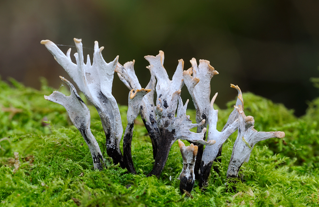
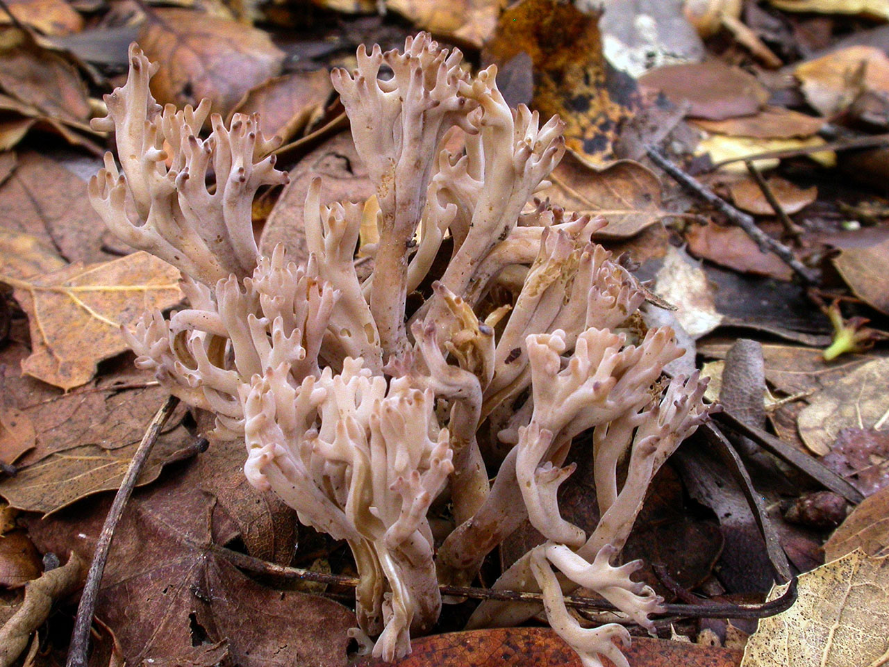
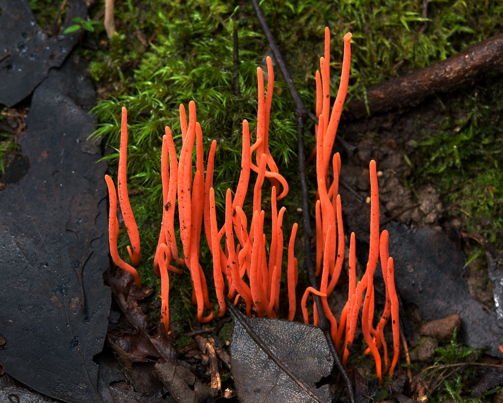
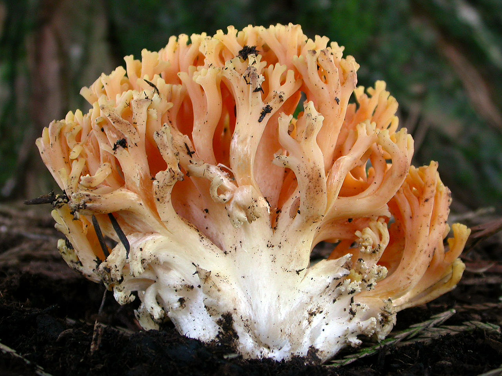
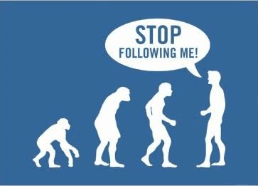
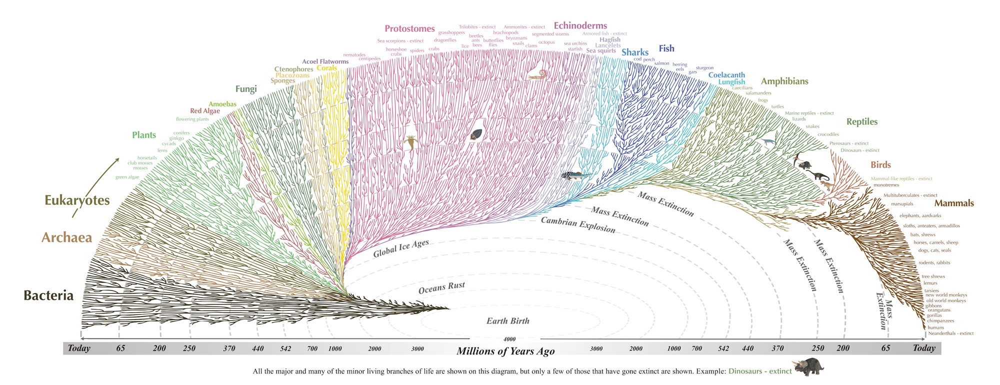

##UNIDAD 1. INTRODUCCIÓN
- La sistemática pretende establecer hipótesis evolutivas a través de expresiones gráficas: los **árboles filogenéticos**. 

- *Estos modelos *son útiles para mostrar de manera concisa la relación de la descendencia con un ancestro en común. 
>*OJO:* el modelo de un árbol es una versión sobresimplificada que *no expresa* toda la realidad evolutiva.

- Saber generar hipótesis evolutivas con un árbol es una herramienta útil por la biología molecular, genética, biología del desarrollo e incluso ecología.

- Otra forma de ver los árboles es *modelar el cambio de los caracteres para descubrir un patrón general*. Incluso podemos imaginarnos cómo ese carácter dio origen a los caracteres de los organismos que descendieron del ancestro. 

- Los árboles nos ayudan a reconstruir cambios evolutivos en cualquier tipo de carácter que pase de una generación a otra (ejemplo: caracteres físicos como color del píleo o de esporas, o distribución geográfica). 
>*OJO*: siempre se debe tener cuidado entre las interpretaciones de la ancestría-descendencia de los caracteres (por ejemplo: los hongos clavarioides).






```
Pregunta: ¿Cuáles son los caracteres morfológicos que nos pueden ayudar a conocer 
las relaciones de ancestría-descendencia en hongos?
```

- Al definir la relación de ancestro común nos permite crear un **significado evolutivo en los sistemas taxonómicos**. Si logramos ponerle historia evolutiva a la taxonom ía, entonces los taxa relacionados tendrán caracteres en común. 

- Una vez que se tiene definido cómo se hará el árbol, se puede complementar *anotando en las ramas los caracteres* de cada taxa.

- Además de conocer la historia del linaje de alguna especie o de los caracteres de un organismo, también podemos conocer la historia de los genes. Los genes también se pueden asignar a categorías como familias o subfamilias de genes.

>**IDEAS QUE DEBEMOS QUITARNOS ANTES DE SEGUIR CON EL CURSO**

>1. La evolución no es una escalera (ladder thinking), hay que recordar que hay especies extintas que fueron ancestros sólo de algunas de las especies que hoy existen.




>2. No existen una especie que sea la cumbre en la evolución, el hombre no es el ser más evolucionado que existe (visión antropocentrista).




>3. La biología molecular no tiene la última palabra en la reconstrucción filogenética, es una herramienta más.
>4. La morfología no está peleada con lo que nos dicen sus moléculas.
