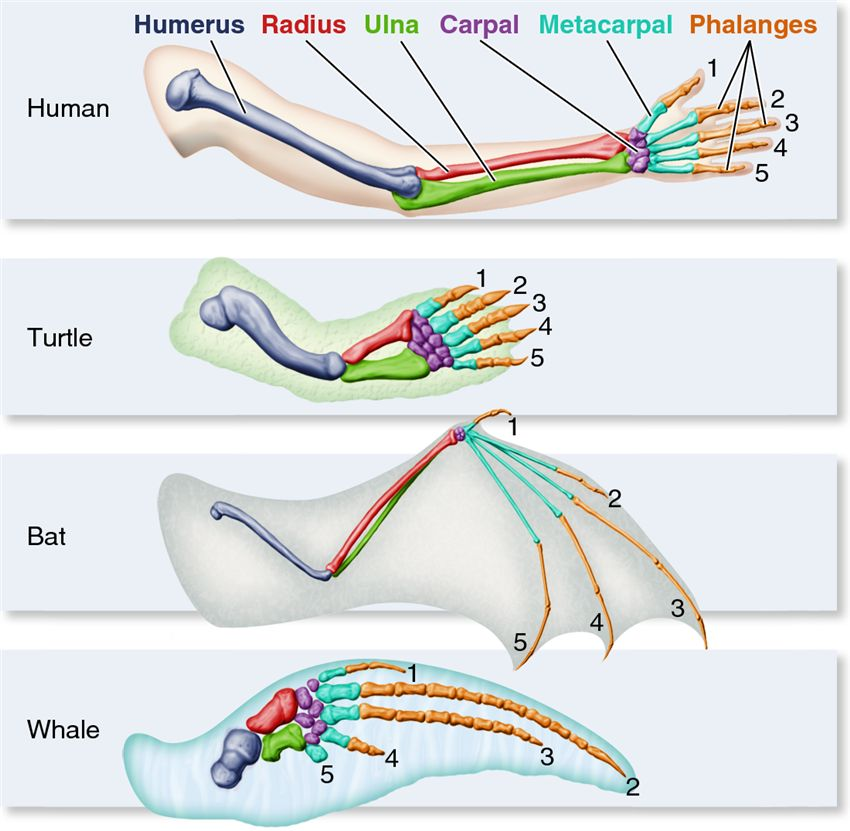
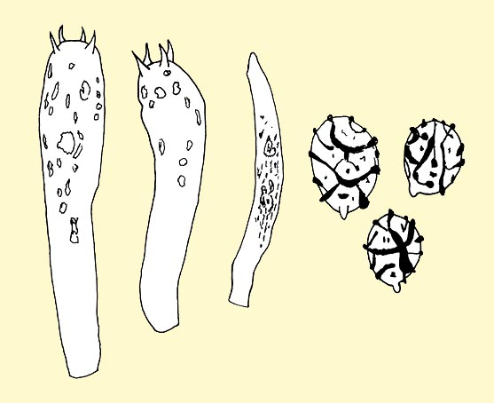
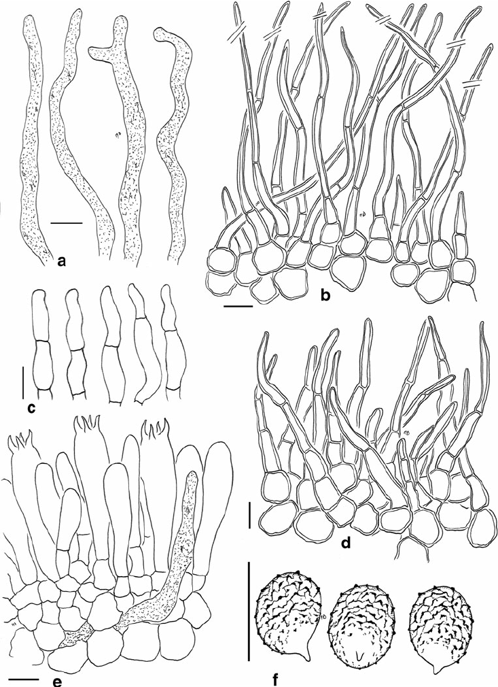
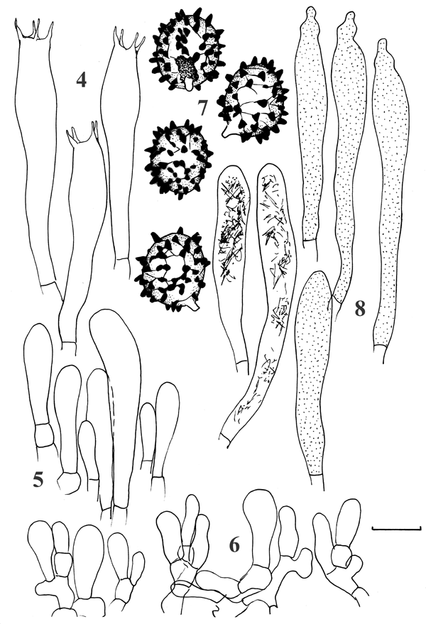
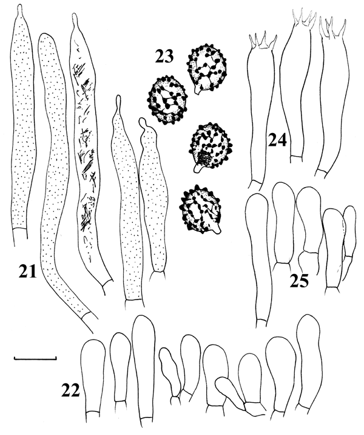
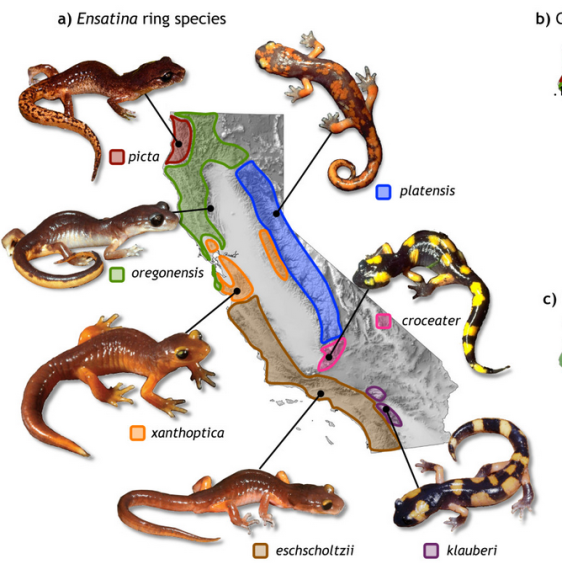

##UNIDAD 2. IMPORTANCIA DE LA SISTEMÁTICA EN LA EVOLUCIÓN

- Una tarea importante de la sistemática es **encontrar la evidencia de la evolución y la ancestría en común**

####Algunas clases de evidencia####

**Similitud estructural**
Caracteres de diferentes especies muestran similitudes estructurales, a pesar de que sean especies adaptadas a diferentes estilos de vida e incluso cuando los caracteres parecen no tener ninguna utilidad

>Un ejemplo sería la familia Russulaceae
***Lactarius deliciosus***

***Lactifluus sudanicus***

***Russula brevipes***

***Russula romagnesiana***

**Similitudes moleculares**
Diferentes especies tienen numerosas similitudes moleculares que incluyen caracteres generales, como tener los mismos ácidos nucleicos y proteínas, o la presencia de genes de composición muy similar

**Distribución geográfica**
Las especies suelen vivir en la misma parte que sus parientes más cercanos y generalmente no se encuentran en regiones distantes. Los fósiles también tienden a encontrarse en partes del mundo similares a sus parientes vivos.

***Fósiles ***
Los fósiles más antiguos son más diferentes de las especies vivas, que los fósiles más recientes. Algunos fósiles transicionales aparecen entre diferentes especies actuales.

El entomólogo **Willi Henning** (1913-1976) y el botánico **Walter Zimmerman** (1892-1980) durante los 1930’s a 60’s desarrollaron un sistema taxonómico llamado **sistemática filogenética**. Sus fundamentos son: 

1) elucidar el árbol verdadero usando **la observación de los caracteres** de los organismos. 

2) el grado de relación entre organismos se debe entender en términos de tener un ancestro común. 

3) **las relaciones filogenéticas deben ser la base de la clasificación biológica**. La manera de clasificar se basaba meramente en similitud observable. *Hasta 1980’s-90’s* los métodos sobre inferencia filogenética *desarrollaron métodos estadísticos* en computadora, que permitieron hacer comparaciones numéricas.
