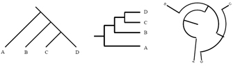
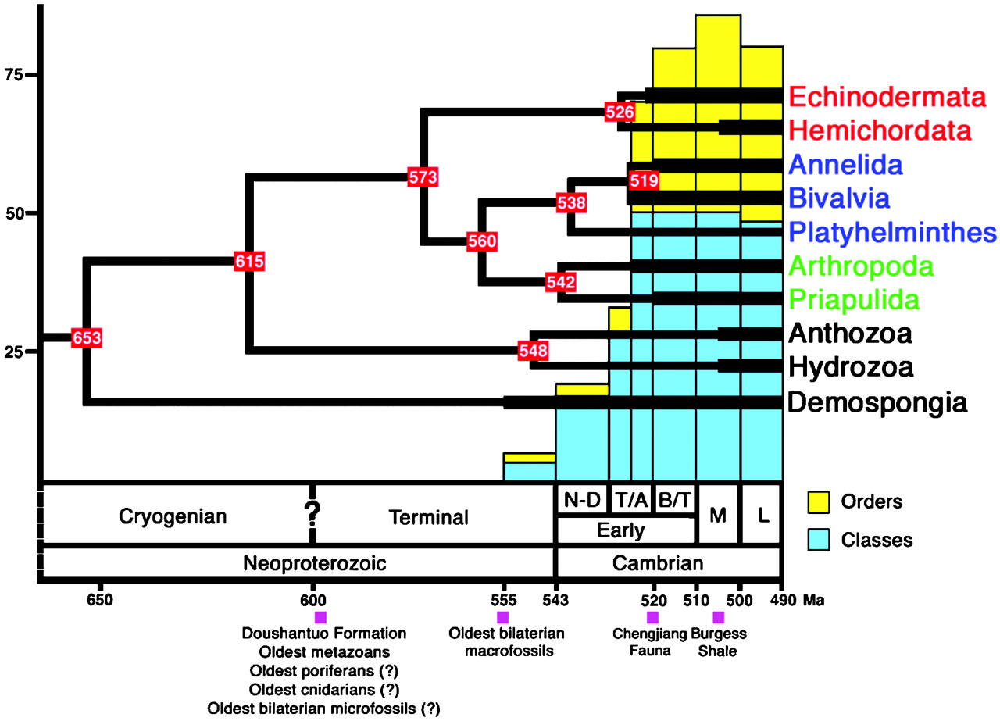
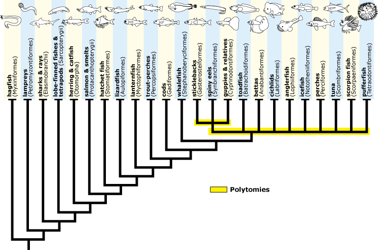
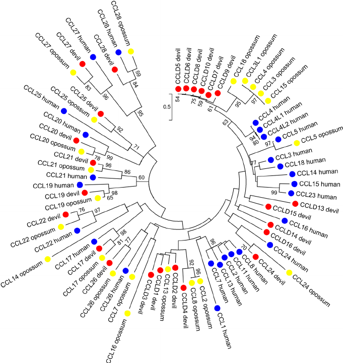
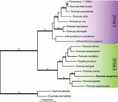
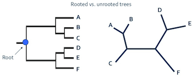
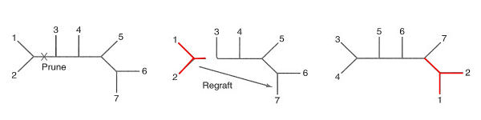

##UNIDAD 3. ¿QUÉ REPRESENTAN LOS ÁRBOLES?

- Vamos a hacernos una imagen de cómo va sucediendo le evolución (imagen de entrecruzamiento). 

- Durante la evolución los linajes suelen divergir o “separarse”. A esto se le conoce como **cladogénesis** (génesis=origen, clados=ramas). 
- Los linajes nuevos se toman como especies, y estos linajes nuevos son generados a partir de un **evento de especiación**. La formación de nuevos linajes se puede dar por aislamiento geográfico (**especiación alopátrica**), por especialización ecológica (**simpátrica**).


###3.1 Terminología de los árboles###



- Las líneas en los diagramas de árboles se llaman ramas y están conectadas por nodos. 
- Para considerarse un árbol, este tiene que ser dirigido (las ramas sólo van en una dirección) y acíclico (las líneas divergentes jamás se fusionan). 
- Las puntas de las ramas se les conoce como **terminales**; si las terminales corresponden a nombres científicos entonces se llaman taxa. 
- Las ramas representan linajes evolutivos y los nodos corresponden a eventos de especiación, es decir el último **ancestro en común**. 
- La **raíz** del árbol es un nodo especial que se marca en donde se empieza el diagrama; generalmente la raíz indica un grupo externo no nombrado. 
- Si queremos referirnos a una parte del árbol que desciende de un mismo linaje ancestral se le llama **clado**. Los clados deben ser monofiléticos. El resto de las ramas en el árbol representan grupos hermanos o taxa hermanos.
- La **topología del árbol** se refiere al orden en que se presentan las ramas. La topología es importante, pues es la que nos indica la relación entre los taxa.
 
>Una forma de expresarla es con nuestro dibujo del árbol, sin embargo también se puede usar la forma parentética: (A(B(CD))).

```
EJERCICIO: Ahora ustedes dibujen este árbol (H((GB)(F((EA)(DC)))))
```

###3.2 “*Merging* y *pruning*” (fusión y poda)###


- Muchas veces contamos con árboles grandes que no nos sirven para trabajar, por lo que las herramientas de *merging* y *pruning* nos ayudan a simplificar los árboles.

- El *pruning* (poda) no afecta las relaciones de ancestría-descendencia:


>Para hacer un buen *pruning* deben: 
1) Encontrar un clado pequeño en el árbol y notar cuáles son las terminales incluidas. 

2) Encontrar la menor parte del clado que incluya todas esas terminales. 

3) Notar cualquiera de las terminales que están en el clado en el árbol grande que ahora no están incluidas en el árbol pequeño que generaron. 

4) Si hay extra-terminales que quieren agregar al árbol pequeño entonces ya no es equiparable al árbol grande. 

5) Si después de considerar todos los clados del árbol pequeño no se encuentra incompatibilidad, entonces el árbol pequeño es válido.

```
EJERCICIO: Del árbol anterior corten F y E, y dibujen el árbol resultante
``` 

- En *merging* (fusión) lo que se hace es simplificar un pequeño clado del árbol en una sola rama.

```
EJERCICIO: Del árbol que dibujaron al principio, asuman que: F, E, A, D y C forman un clado llamado “A”. Simplifiquen haciendo merging dibujando el árbol resultante con el clado “A”.
```

###3.3 El eje del tiempo###
- Un árbol es una crónica histórica donde los nodos y *las ramas representan poblaciones ancestrales que vivieron en un momento del pasado*. Un árbol debe contener información implícita del tiempo relativo de los diferentes eventos de especiación de los linajes. 
- Dos nodos que estén sobre la misma línea representan una relación entre ellos. El nodo que se encuentre más cerca de la raíz representa una población más ancestral que la otra, por lo que existió desde antes.
- Una forma esquemática de poner la edad de los nodos es que el largo de las ramas representen tiempo, y generalmente esto va asociado con una escala temporal que nos permite ver la edad aproximada de los nodos. Esos diagramas se llaman **cronogramas** porque contienen información del tiempo.
- Muchas veces los fósiles ayudan a datar los nodos de los cronogramas.



###3.4 Longitud de las ramas y tasa de evolución###

- Como ya dijimos, los árboles nos ayudan a inferir relaciones evolutivas y delimitar grupos taxonómicos. 
- También la longitud de las ramas nos ayuda a entender la **cantidad de cambio** que se ha producido en ese grupo. Entre más cambio evolutivo haya sucedido, las ramas serán sustancialmente más largas. 
- En algunos casos es suficiente con poner las ramas de diferente longitud y poner escalas de tiempo (como en los cronogramas). Sin embargo también existen árboles donde se dibujan las ramas para expresar el promedio de cambios que han ocurrido en los caracteres de ese grupo; a estos árboles se les llama **filogramas**.
- La longitud de las ramas en los filogramas están relacionados a un set específico de datos; comúnmente son secuencias de genes que se usan para inferir el árbol (como lo veremos más adelante).


###3.5 Incertidumbre en la filogenia###

- Hasta ahora todos los árboles que hemos dibujado son **binarios**, es decir que el linaje ancestral dio orgen a dos linajes. Los árboles que son completamente binarios se les conoce como **completamente resueltos**. 
- Sin embargo puede que un ancestro de origen a más de dos linajes, a esto se le llama **politomía**. 
- Si los nodos politómicos son reales entonces se dice que es una **politomía dura**. 
>OJO: Generalemente las politomías indican incertidumbre en que sea correcto el patrón de ramificación.



- Las politomías que se usan para comunicar incertidumbre en la topología del árbol se llaman **politomías suaves**.
- Cuando generamos varios árboles que nos cuentan diferentes historias evolutivas, podemos generar **árboles de consenso estricto**. Estos árboles son compuestos por clados que existen en todos los árboles. (dibujito)
>Para interpretar de manera correcta la topología de un árbol cuando hay politomías, lo mejor es considerarlas como incertidumbres con una probabilidad de que se trate de unas politomías duras.
- Cuando tenemos análisis con datos reales contamos con **niveles de soporte en cada rama**, que nos ayuda a inferir si las politomías son duras o suaves. Estos valores son anotaciones en el árbol que nos indican el grado de confianza.
- La medida más comúnmente utilizada es el **porcentaje de *bootstrap* ** (que va del 1 al 100%) y la **probabilidad posterior** (que va del 0 al 1.0)
- Entre más grande sea el valor, mayor será su nivel de soporte de esa rama.
>El ***threshold*** (valor de corte) es subjetivo, sin embargo la mayoría toma el >80% de bootstrap o >0.95 de probabilidad posterior, como un buen soporte.





###3.6 Árboles sin raíz###

- Los árboles enraizados contienen información que nos permite entender el patrón de descendencia de un ancestro en común, y la dirección de la evolución de los caracteres.



- Los árboles sin raíz no tienen definida la raíz. En estos árboles las ramas representan linajes evolutivos, pero sin raíz, no se sabemos cuál es el camino que la evolución ha tomado a lo largo de los linajes.
- Como los clados comprenden a el ancestro y todos sus descendientes, necesitamos informaciónn sobre el origen para encontrar los clados.
- Más adelante vamos a aprender a decidir cómo y con qué enraizar nuestros árboles. Sólo para recordarles, siempre debemos tratar de enraizar con **grupos hermanos (*outgroup*)**

###3.7 Distancia entre árbol-árbol###

(Dibujito)

- En el caso del dibujo la mejor forma de comparar topologías es contar el número de cambios que hay entre un árbol y otro
- Existen métodos para hacer arreglos en los árboles, como el ***subtree pruning and regrafting*** (SPR)



- Con esta herramienta es posible convertir el árbol en una topología completamente distinta haciendo una serie de SPR


>Tarea: Resolver páginas de 68 a 75 del libro de [Tree Thinking](http://www.botanicaamazonica.wiki.br/labotam/lib/exe/fetch.php?media=bib:baumsmith2013_tree_thinking_book.pdf)


