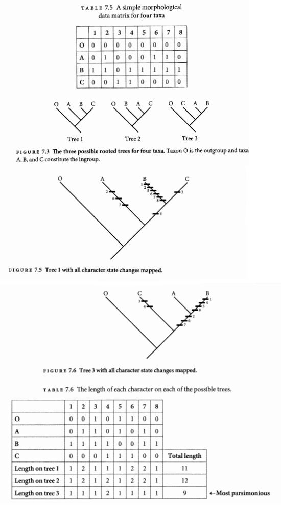

#UNIDAD 4. EVOLUCIÓN DE CARACTERES#

- Imaginemos que tenemos una población donde todos tienen píleos color rojo y tras una mutación se forma el fenotipo azul. Después de varias generaciones los píleos azules se vuelven más comunes. En este caso el color rojo es **ancestral** y el azul es **derivado**.
- Con el paso de varias generaciones el píleo azul incrementa su frecuencia y favorece al hongo. Finalmente después de muchas generaciones, toda la población adquiere el píleo de color azul hasta haberse **fijado**.


- A nivel de especie, a través de las generaciones el fenotipo evolucionó. La población inicial tenía un **estado de caracter ancestral**: píleo rojo. Y después de muchas generaciones se fijó un **estado de caracter derivado**, el píleo azul.
- El tiempo de mutación a fijación del estado de caracter derivado lleva muchas más generaciones que las que generalmente una vida humana puede observar.
- Por eso usamos los árboles filogenéticos como  hipótesis de los cambios en la evolución de los organismos.

>OJO: tenemos que saber discernir entre lo que es un caracter y sus estados de caracter.

 ```
Ejercicio: sugieran caracteres y estados de caracter de su hongo favorito
 ```

>Por ejemplo la hipótesis de la evolución de las trufas


Tomada de Lassoe & Hansen (2007)

###4.1 Estados de caracter ancestrales y derivados###
- Cualquier caracter con dos estados alternativos tienen **polaridad**, es decir la dirección de evolución: uno de ellos es el ancesttral y el otro derivado.

- Determinar la polaridad de los caracteres es importante para la evidencia filogenética.
- En este sentido hay caracteres que son **plesiomórficos**, es decir estados de caracter ancestrales y **apomórficos**, estados de caracter derivados. Los estados de caracter derivados compartidos se llaman **sinapormorfias**.  Y los grupos que comparten estados de caracter ancestrales se conocen como **simplesiomorfias**.

>Debemos tener como objetivo *siempre encontrar sinapormofias*, evidenemente asociados a grupos monofiléticos.

###4.2 Evolución de secuencias de DNA###
- El *fenotipo* siempre es el resultado de los cambios en el DNA, mientras que *no todos los cambios en el DNA son visibles*. 
- Prácticamente todos los cambios en el fenotipo son heredables y son atribuidos a cambios en el DNA.
- Recordemos que la doble cadena del DNA está compuesta de nucleótidos. Si tenemos una copia idéntica de la posición de los nucleótidos en todos los descendientes, hablamos de **homología**.
- La replicación del DNA es imperfecta, lo que puede generar mutaciones puntuales en las posiciones de nucleótidos. Si el nucleótido es reemplazado por uno distinto le llamamos **sustitución**.

 

- También podemos encontrar en las secuencias **deleciones**, es decir pérdida de nucleótidos o **inserciones**. 

>Cuando hacemos alineamientos a las inserciones/deleciones se les llama ***indel***.

- Tanto las sustituciones como caracteres morfológicos son interpretados como evidencia independiente de la estructura del "árbol verdadero".

###4.3 Introducción a la homología###
- Como dijimos antes, en las secuencias de DNA se considera homología sino hay sustituciones. Sin embargo, la morfología no tiene que ser completamente idéntica a su ancestro; aunque los caracteres fenotípicos son heredables.

-También existen caracteres que evolucionan de manera independiente en dos organismos distintos, a lo cual llamados **convergencia evolutiva**. No es homología.

- Hay casos donde este caracter que parece ser **autapomorfias** (caracteres derivados únicos), en realidad podrían tratarse de **reversiones** de un estado ancestral.

>Recuerden que la homología se basa en tener un ancestro en común, no similitud. Por ejemplo:

 
 ***Thelephora versatilis* Ramírez-López & Villegas** 
 
 ***Thelephora pseudoversatilis* Ramírez-López & Villegas** 
 
 
Tomada de Ramírez-López et al. 2015

###4.4 Homoplasia y consistencia###
- La **homoplasia** se da cuando los estados de caracter se encuentran en más de un grupo dentro de un árbol. La convergencia evolutiva es un tipo de homoplasia.
>OJO: Homología *NO* es lo opuesto a homoplasia. Homología se refiere a la relación entre caracteres en diferentes taxa, mientras que homoplasia se refiere a la relación entre la variación de los caracteres en un árbol en específico.

- La **consistencia** es lo opuesto a la homoplasia. Un caracter es consistente cuando evoluciona sin cambios extra o cambios de estado. 

>Por ejemplo: píleo rojo o píleo azul; sólo hay un cambio entre ellos

- La consistencia se mantiene si el número de cambios de caracter es uno menos que el número de estados de caracter.

- Una forma útil de cuantificar la consistencia es usando el ***consistency index* (CI)**. Este índice reporta el número de cambios mínimos necesarios para explicar la evolución de los caracteres (**Lmin**), que es uno menos que el número de estados de caracter; dividido entre el número de cambios de estado observados (**Lobs**).

 ```
CI=Lmin/Lobs
 ```
 

Tomado de Tree thinking

- También existe el **índice de retención (RI)** que también es ampliamente usado. Este corrige el número máximo de pasos que el caracter puede tener en un árbol (Lmax).

```
RI=(Lmax - Lobs)/(Lmax - Lmin)
 ```
> Muchas veces se prefiere el RI ya que usa un rango del 0 al 1.

- Ambos índices proveen una forma de medir la concordancia entre los caracteres y el árbol. **Entre más alto sea el CI o RI, hay MENOS homoplasia implicada**.

- Para poder encontrar al árbol verdadero (el que exprese las relaciones de ancestro-descendiente) podemos usar el árbol que tenga el mayor promedio de CI (**"el árbol más parsimonioso"**)

###4.5 Parsimonia para inferir la historia de los caracteres###

- Una vez que tenemos un árbol, tenemos ***inferencias*** de cómo han sido los cambios evolutivos de los caracteres.

- La parsimonia es un criterio sencillo para evaluar la evolución de los caracteres, y cómo estos nos ayudan a reconstruir la historia filogenética.

>Por ejemplo:


Tomado de Alvarez-Manjarrez et al. 2016

- La historia más plausible por aplicar es la del **principio de parsimonia**, es decir, el patrón observado requiere el mínimo número de orígenes (o pérdidas) evolutivos.

> Para hacer inferencias filogenéticas sea cual sea nuestro método, debemos:
1. construir una matriz de datos
2. idenfiticar cuál es el árbol más compatible con nuestra matriz
3. correr análisis estadísticos para evaluar la confianza de nuestras conclusiones

- Para poder construir una matriz adecuada debemos decidir cuántas terminales incluiremos y cuántos caracteres incluiremos de cada terminal.

 ```
Pregunta: ¿Cuántas terminales y caracteres usarán en sus tesis?
 ```

> Antes de los 90's todos los análisis filogenéticos usaban caracteres morfológicos. Hoy en día se pueden tomar caracteres moleculares, ecológicos, fisiológicos, etc.

- Otra de las cosas a considerar para armar una matriz es el **grupo externo**. Estos sirven como punto de comparación entre los que están dentro del grupo de estudio; para dar una raíz y determinar la polaridad de los caracteres.

- Si tuviéramos una matriz de caracteres morfológicos, tendríamos que codificar en números que nos den alguna información de cada terminal. Las terminales que tuvieran múltiples estados de caracter se les conoce como **polimórficos**.
- En las matrices de caracteres moleculares no es necesaria la codificación, pues tenemos únicamente 4 estados de caracter (A, C, G o T). En estas matrices podemos encontrar ***gaps***, los cuales indican inserciones o deleciones. Para establecer homología en los caracteres moleculares debemos hacer **alineamiento de secuencias**.


```
Ejercicio de alineamiento: 
 ```
1. Descargar el programa [PhyDE](http://www.phyde.de/download.html) e instalarlo
2. Descargar el programa [Notepad ++](https://notepad-plus-plus.org/download/v6.9.2.html) e instalarlo
3. Mientras se instalan bajen de *nucleotide NCBI* las secuencias en formato FASTA: KU985206,  KU248114, KU248106


4. Abran las secuencias FASTA con Notepad ++ y vamos a editar los nombres de las secuencias dejando el código de acceso, el nombre de la especie y todos los espacios los vamos a sustituir con "_", hasta dejarlas así: 


5. Ingresen a la página de *Multiple alignment program for amino acid or nucleotide sequences* [MAFFT](http://mafft.cbrc.jp/alignment/server/index.html)


6. Descarguen el alineamiento en formato PAUP| Nexus


7. Ahora abran el alineamiento con PhyDE y ¡vamos a alinear!

>OJO: además de MAFFT existen otros programas de alineamiento con diferentes algoritmos, por ejemplo: CLUSTALx, Muscle, TCOFFEE, FAS, etc.

- En parsimonia la homoplasia no es viable. Si permitimos homoplasia entonces no podremos reconciliar una matriz de datos con ningún árbol. Si esto sucede necesitaremos el **criterio de optimalidad**, una medida que nos ayuda a definir cuáles son los mejores y peores árboles. Actualmente este criterio ha sido reemplazado por la **máxima parsimonia**.

####4.5.1 Criterio de máxima parsimonia####
1. En un árbol, consideramos todos los caracteres y determinamos el mínimo número de cambios en cada estado de caracter (**pasos**), que son requeridos para considerar la distribución de los estados a lo largo de las ramas.
2.  Sumamos el número de pasos requeridos por cada caracter. El número de pasos requeridos para explicar la evolución del caracter se conoce como **longitud del árbol**.
3. Repetimos lo anterior en árboles alternativos e identificamos el árbol **más corto** o **más parsimonioso**.



####4.5.2 Encontrando el árbol óptimo####

- En el ejemplo anterior teníamos 4 terminales, lo que nos da un número pequeño de posibles árboles; entre más terminales tenemos, mayor número de árboles se pueden generar.

 ```
La forma en que crecen la cantidad de árboles cuando aumentamos terminales es:
(2n-3)!/[2^n-2 x (n-2)!]
 ```

- Necesitamos un gran poder computacional para poder resolver los análisis de estadísticos árboles con >10 terminales.
- Para los análisis grandes se han desarrollado las **búsquedas heurísticas** que no garantiza encontrar el árbol óptimo, pero sí uno muy cercano.

>Antes de continuar debe quedarnos claro lo que es el **universo** de árboles.  Este universo es multidimensional: cada dimensión corresponde a la distancia de cada árbol comparado con el resto de los árboles; además de la calidad del árbol (más parsimonioso).


- Los programas computacionales deben permitir buscar en el universo de árboles, usando algoritmos *hill-climbing*. Estos algoritmos pueden encontrar óptimos locales pero su finalidad es buscar el óptimo global.

- En las filogenias moleculares de parsimonia hay matrices que califican las **transiciones** y **transversiones**.


 ```
Otro ejercicio
 ```
1. Descarga el programa [Mesquite](http://mesquiteproject.wikispaces.com/installation) e instálalo
2. Descarga el programa [TNT](http://www.zmuc.dk/public/phylogeny/tnt/) e instálalo
3. El archivo de las secuencias de *Amanita* que previamente alineamos ábrelo con Mesquite y expórtalo como: "amanita.tnt"
4. Guarda amanita.tnt en la carpeta de TNT. Abre TNT y carga el archivo amanita.tnt
5. Ahora vamos a correr un análisis de parsimonia con *Traditional search* y otro con *New Technology search*. Nuestro grupo externo va a ser *Amanita muscaria*.

####4.5.3 Desventajas de la parsimonia####
- No toma en cuenta la longitud de las ramas: si en la filogenia se encuentran ramas cortas y otras largas, la parsimonia cometerá errores como la **atracción de las ramas largas**. Y cometerá más errores conforme estas características aumenten.
- La parsimonia siempre requiere que demos peso a los caracteres y esto generalemten afectan las conclusiones. (No existe un buen método para ponderar caracteres)
- Actualmente la comunidad científica puede aceptar análsis de parsimonia si se conoce poco sobre la evolución del grupo, pero generalmente se esperan análisis de **máxima verosimilitud** o **métodos bayesianos**.


 ```
Tarea: Descarguen 5 secuencias de su(s) hongo(s) de interés y alineanlas para la siguiente clase. Incluyan un grupo externo.
 ```
