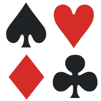
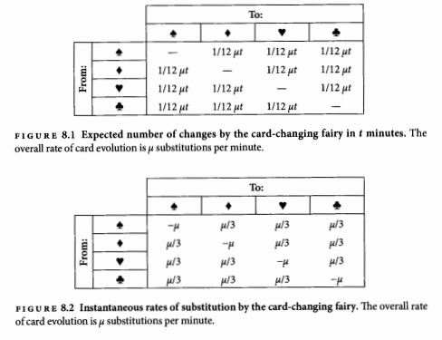
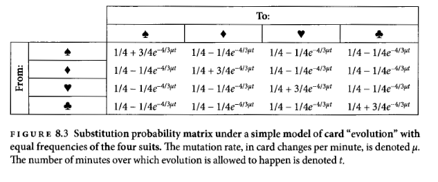
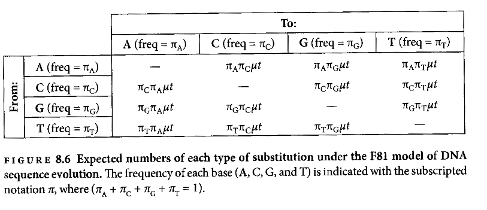
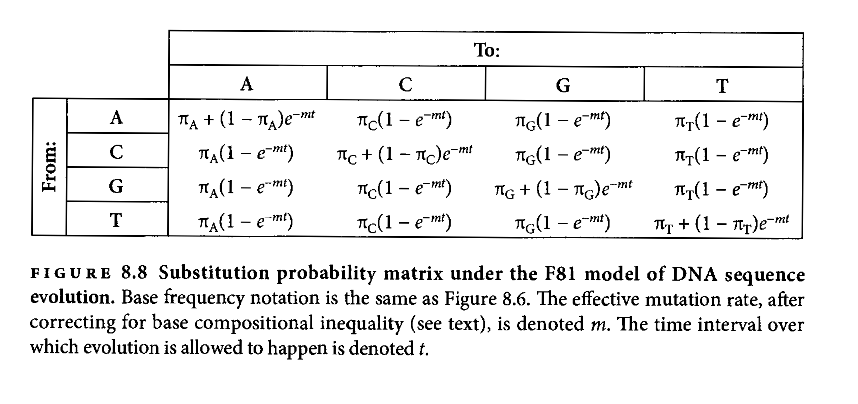
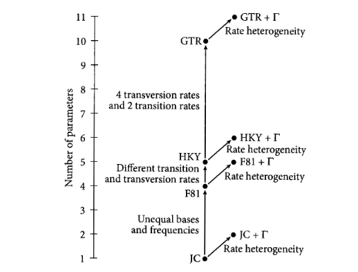

##UNIDAD 5. INFERENCIA FILOGENÉTICA CON MÁXIMA VEROSIMILITUD Y MÉTODOS BAYESIANOS##

- Estos modelos matemáticos tienen como punto central los **modelos de sustitución**; estos especifican la forma en que los estados de caracter tienen permitido cambiar, así como las tasas relativas de cambio evolutivo.
- Todos los modelos usan los **modelos de Markov**, es decir, decriben un proceso en el que la P de que ocurra un evento en un momento en el tiempo depende sólo del estado actual e independientemente de cómo llegó a ser ese estado.
 

 ``` 
Por ejemplo: el lanzamiento de una moneda. La probabilidad de que caiga águila siempre será 0.5, independientemente de los demás lanzamientos
```
- Trabajar con secuencias de DNA es fácil, pues sólo hay 4 estados de caracter. Los ***indels*** no están incluidos en los modelos de sustitución ya que agrega mucha complejidad a los análisis. Los ***gaps*** se toman como datos faltantes, es decir que podría ser cualquier nucleótido.
- Los modelos de sustitución pueden ser **reversibles**: la probabilidad de cambio es igual en cualquier dirección.
- Se debe asumir que todas las posiciones de DNA son ocupadas por alguna de las cuatros bases, en cualquier momento. Las mutaciones se pueden presentar de dos maneras: a)puede haber una sustitución del nucleótido por otro nucleótido igual o b) puede sustituirse por uno distinto.



 ``` 
Por ejemplo: Pensemos en una baraja donde tenemos 4 palos. Esos palos van cambiando de manera impredecible a otras cartas a una velocidad tan rápida que ninguno de nosotros lo puede ver. 
Esa velocidad de cambio es una tasa de cambio a la cual llamamos  **μ**.
Si asumimos que μ=0.6 por minuto, entonces en una hora tendremos 36 cambios (0.6x60 min). Aunque haya momentos en que vaya más rápido y otros más lento.
Si observamos durante mucho tiempo la misma posición es probable que veamos los cuatro palos.
```


- Una de las metas de la inferencia filogenética es determinar hace cuánto un par de taxa compatieron a su ancestro en común, es decir, determinar la **distancia evolutiva** (el promedio de número de sustituciones que han ocurrido en una posición).
- Para conocer esto debemos calcular cuál es la **probabilidad de observar un cambio en función de la tasa de sustitución *μ* y el tiempo t**. Entonces construimos una **matriz de la probabilidad de sustitución**
- Estas matrices se generan a través de cálculo y de álgebra de matrices.

>Por ejemplo: esta matriz sería la resultante de nuestro ejemplo de la baraja


>¿Cuál sería la probabilidad de empezar como corazón y terminar como corazón?
Si *μt* es pequeño, entonces e^*μt* será cercano a 1.0. Esto tiene sentido si asumimos que la tasa de sustitución y el tiempo han sido cortos es probable que no haya habido ningún cambio.
Pero cuando *μt* es grande, entonces la probabilidad será cercana a 0, lo que querría decir que la probabilidad de ser cualquiera de los otros palos es 1/4 (0.25)

- Ahora translademos nuestro ejemplo a DNA. Las cartas serían los 4 nucleótidos, una sóla carta correspondiería a una posición de DNA.
- El modelo de sustitución más simple fue desarrollado por Jukes y Cantor, y generalmente lo conocemos como **Jukes-Cantor** o **JC**. Este modelo asume que a) las cuatro bases ocurren en la misma frecuencia, b) cualquier sustitución tiene la misma tasa (A ->C o A->T, etc.) y c) la tasa de sustitución en la misma en cualquier posición de la secuencia estudiada.
- Si pensamos en una secuencia ancestral , ésta va cambiando "gradualmente" y se van acumulando los cambios. Conforme pasa más tiempo suceden más cambios hasta generar diferencias en las secuencias.

###5.1 Modelos más realistas sobre la evolución molecular###

- El modelo de JC es accesible para empezar a entender los modelos de evolución molecular, sin embargo viola mucho del conocimiento actual sobre el DNA.
a) Las cuatro bases no se presentan en igual frecuencia
b) Algunos tipos de sustitución ocurren a diferentes tasas que otras
c) Algunas posiciones del DNA tienen mayores tasas de evolución

- La primera extensión del modelo JC fue permitir que las bases tuvieran diferentes frecuencias. Este modelo es llamado **F81** (Felsenstein 1981). 
- La frecuencia la representaremos con ***π***. Como tenemos 4 bases, tenemos que la frecuencia de las bases (*π*A, *π*C, *π*G y *π*T) suman 1.0. Asumiento que tenemos una G en el tiempo 0 es igual a *π*G. Después de una mutación, la probabilidad de que la nueva base sea G es *π*G, otra vez. Esto significa que el número de mutaciones esperadas en un tiempo *μt*, es el producto de las frecuencias de la base inicial y final.



- La matriz anterior nos muestra que da igual si pasamos de A a T o de T a A.  Sin embargo el F81, tiene una corrección donde utiliza la frecuencia de la base incial y la final.
- Es decir que dependiendo de la frecuencia de A o de T, la matriz de sustitución será distinta.



> La discrepancia radica en que si hay una sustitución "rara", va a tender a cambiar rápidamente a otra base; pero si hay una base común va a tender a permanecer sin cambios.


- El **siguiente nivel de complejidad** involucra **diferentes tasas para diferentes tipos de sustitución**.
- Volviendo al ejemplo de las cartas, imaginemos que es frecuente que exista una sustitución entre los palos rojos, y que sea poco probable que haya sustitución de un rojo por un negro.
- Eso traducido al DNA es como generalmente funciona por su estructura bioquímica... las **transiciones** se dan de purina-purina o pirimidina-pirimidina y son más comunes en comparación con las **transversiones**, es decir de purinas a pirimidinas y viceversa. A este fenómeno se le conoce como ***transition:transversion bias***.
- El método de acomodar la desigualdad en la tasa de la sustitución se hace para incluir un parámetro en el modelo que ajuste la tasa a cada uno de los cambios. Por ejemplo el modelo **HKY** (Hasegawa, Kishino y Yano 1985) que incluye desigualdad en la frecuencia de las bases y la *transition:transversion bias*.
- Además de los modelos previamente mencionados, existen muchos más con diferentes variantes.
- El modelo más complejo es el ***general time-reversible* (GTR)** donde incluye 4 tasas de transversión y 2 tasas de transición, más todo lo que incluyen los otros modelos.

 

- El principal defecto que tienen los modelos de sustitución es que asumen que las tasas de sustitución serán iguales para toda la región de DNA que analizamos, o para todos los genes que usamos.
- Para eliminar este problema se han inventado herrmientas como las **particiones**, donde utilizamos diferentes modelos de sustitución por regiones. O tamién se han desarrollado programas que usan varios modelos a la vez [mixture models](https://www.researchgate.net/profile/Bernard_Moret/publication/37441572_Reconstructing_phylogenies_from_gene-content_and_gene-order_data/links/0deec532037f454ce9000000.pdf#page=148)  o [reversible-jump](http://www.jstor.org/stable/10.1086/503444?seq=1#page_scan_tab_contents).


``` 
Ejercicio
``` 
1. Descarga [jModelTest](https://github.com/ddarriba/jmodeltest2) e instálalo
2. Abre el archivo de las secuencias que alineamos previamente en formato NEXUS en jModelTest
3. Ahora correremos un análisis para que seleccione los modelos de sustitución aptos para nuestra matriz.
