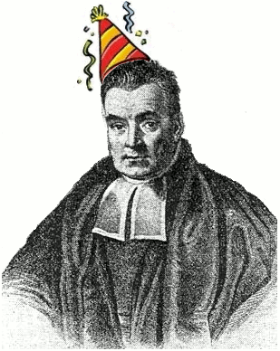

##UNIDAD 5. INFERENCIA FILOGENÉTICA CON MÁXIMA VEROSIMILITUD Y MÉTODOS BAYESIANOS##

- Estos modelos matemáticos tienen como punto central los **modelos de sustitución**; estos especifican la forma en que los estados de caracter tienen permitido cambiar, así como las tasas relativas de cambio evolutivo.
- Todos los modelos usan los **modelos de Markov**, es decir, decriben un proceso en el que la P de que ocurra un evento en un momento en el tiempo depende sólo del estado actual e independientemente de cómo llegó a ser ese estado.
 

 ``` 
Por ejemplo: el lanzamiento de una moneda. La probabilidad de que caiga águila siempre será 0.5, independientemente de los demás lanzamientos
```
- Trabajar con secuencias de DNA es fácil, pues sólo hay 4 estados de caracter. Los ***indels*** no están incluidos en los modelos de sustitución ya que agrega mucha complejidad a los análisis. Los ***gaps*** se toman como datos faltantes, es decir que podría ser cualquier nucleótido.
- Los modelos de sustitución pueden ser **reversibles**: la probabilidad de cambio es igual en cualquier dirección.
- Se debe asumir que todas las posiciones de DNA son ocupadas por alguna de las cuatros bases, en cualquier momento. Las mutaciones se pueden presentar de dos maneras: a)puede haber una sustitución del nucleótido por otro nucleótido igual o b) puede sustituirse por uno distinto.


 ``` 
Por ejemplo: Pensemos en una baraja donde tenemos 4 palos. Esos palos van cambiando de manera impredecible a otras cartas a una velocidad tan rápida que ninguno de nosotros lo puede ver. 
Esa velocidad de cambio es una tasa de cambio a la cual llamamos  **μ**.
Si asumimos que μ=0.6 por minuto, entonces en una hora tendremos 36 cambios (0.6x60 min). Aunque haya momentos en que vaya más rápido y otros más lento.
Si observamos durante mucho tiempo la misma posición es probable que veamos los cuatro palos.
```


- Una de las metas de la inferencia filogenética es determinar hace cuánto un par de taxa compatieron a su ancestro en común, es decir, determinar la **distancia evolutiva** (el promedio de número de sustituciones que han ocurrido en una posición).
- Para conocer esto debemos calcular cuál es la **probabilidad de observar un cambio en función de la tasa de sustitución *μ* y el tiempo t**. Entonces construimos una **matriz de la probabilidad de sustitución**
- Estas matrices se generan a través de cálculo y de álgebra de matrices.

>Por ejemplo: esta matriz sería la resultante de nuestro ejemplo de la baraja


>¿Cuál sería la probabilidad de empezar como corazón y terminar como corazón?
Si *μt* es pequeño, entonces e^*μt* será cercano a 1.0. Esto tiene sentido si asumimos que la tasa de sustitución y el tiempo han sido cortos es probable que no haya habido ningún cambio.
Pero cuando *μt* es grande, entonces la probabilidad será cercana a 0, lo que querría decir que la probabilidad de ser cualquiera de los otros palos es 1/4 (0.25)

- Ahora translademos nuestro ejemplo a DNA. Las cartas serían los 4 nucleótidos, una sóla carta correspondiería a una posición de DNA.
- El modelo de sustitución más simple fue desarrollado por Jukes y Cantor, y generalmente lo conocemos como **Jukes-Cantor** o **JC**. Este modelo asume que a) las cuatro bases ocurren en la misma frecuencia, b) cualquier sustitución tiene la misma tasa (A ->C o A->T, etc.) y c) la tasa de sustitución en la misma en cualquier posición de la secuencia estudiada.
- Si pensamos en una secuencia ancestral , ésta va cambiando "gradualmente" y se van acumulando los cambios. Conforme pasa más tiempo suceden más cambios hasta generar diferencias en las secuencias.

###5.1 Modelos más realistas sobre la evolución molecular###

- El modelo de JC es accesible para empezar a entender los modelos de evolución molecular, sin embargo viola mucho del conocimiento actual sobre el DNA.
a) Las cuatro bases no se presentan en igual frecuencia
b) Algunos tipos de sustitución ocurren a diferentes tasas que otras
c) Algunas posiciones del DNA tienen mayores tasas de evolución

- La primera extensión del modelo JC fue permitir que las bases tuvieran diferentes frecuencias. Este modelo es llamado **F81** (Felsenstein 1981). 
- La frecuencia la representaremos con ***π***. Como tenemos 4 bases, tenemos que la frecuencia de las bases (*π*A, *π*C, *π*G y *π*T) suman 1.0. Asumiento que tenemos una G en el tiempo 0 es igual a *π*G. Después de una mutación, la probabilidad de que la nueva base sea G es *π*G, otra vez. Esto significa que el número de mutaciones esperadas en un tiempo *μt*, es el producto de las frecuencias de la base inicial y final.


- La matriz anterior nos muestra que da igual si pasamos de A a T o de T a A.  Sin embargo el F81, tiene una corrección donde utiliza la frecuencia de la base incial y la final.
- Es decir que dependiendo de la frecuencia de A o de T, la matriz de sustitución será distinta.


> La discrepancia radica en que si hay una sustitución "rara", va a tender a cambiar rápidamente a otra base; pero si hay una base común va a tender a permanecer sin cambios.


- El **siguiente nivel de complejidad** involucra **diferentes tasas para diferentes tipos de sustitución**.
- Volviendo al ejemplo de las cartas, imaginemos que es frecuente que exista una sustitución entre los palos rojos, y que sea poco probable que haya sustitución de un rojo por un negro.
- Eso traducido al DNA es como generalmente funciona por su estructura bioquímica... las **transiciones** se dan de purina-purina o pirimidina-pirimidina y son más comunes en comparación con las **transversiones**, es decir de purinas a pirimidinas y viceversa. A este fenómeno se le conoce como ***transition:transversion bias***.
- El método de acomodar la desigualdad en la tasa de la sustitución se hace para incluir un parámetro en el modelo que ajuste la tasa a cada uno de los cambios. Por ejemplo el modelo **HKY** (Hasegawa, Kishino y Yano 1985) que incluye desigualdad en la frecuencia de las bases y la *transition:transversion bias*.
- Además de los modelos previamente mencionados, existen muchos más con diferentes variantes.
- El modelo más complejo es el ***general time-reversible* (GTR)** donde incluye 4 tasas de transversión y 2 tasas de transición, más todo lo que incluyen los otros modelos.

 

- El principal defecto que tienen los modelos de sustitución es que asumen que las tasas de sustitución serán iguales para toda la región de DNA que analizamos, o para todos los genes que usamos.
- Para eliminar este problema se han inventado herrmientas como las **particiones**, donde utilizamos diferentes modelos de sustitución por regiones. O tamién se han desarrollado programas que usan varios modelos a la vez [mixture models](https://www.researchgate.net/profile/Bernard_Moret/publication/37441572_Reconstructing_phylogenies_from_gene-content_and_gene-order_data/links/0deec532037f454ce9000000.pdf#page=148)  o [reversible-jump](http://www.jstor.org/stable/10.1086/503444?seq=1#page_scan_tab_contents).


``` 
Ejercicio
``` 
1. Descarga [jModelTest](https://github.com/ddarriba/jmodeltest2) e instálalo
2. Abre el archivo de las secuencias que alineaste de tarea, conviértelo en formato NEXUS en Mesquite 
3. Abre el archivo que acabas de generar en jModelTest
4. Ahora correremos un análisis para que seleccione los modelos de sustitución aptos para su matriz.


###5.2 Máxima verosimilitud###

- Esta herramienta busca encontrar el árbol con mayor probabilidad de ser el adecuado para los datos observados.

 

- Explicado de manera sencilla, si lanzamos una moneda asumimos que hay una probabilidad de 1/2 para que caiga águila y que cada tiro es independiente del resultado anterior. Bajo este modelo nosotros estamos calculando el ***likelihood***, donde definimos la probabilidad bajo una hipótesis.
- Si cae 10 veces águila, podemos generarnos la hipótesis de que la moneda es justa, donde el *likelihood* es 0.5^10 o ~0.00098.

>OJO: esto no quiere decir que hay 0.1% de probabilidad de que caiga cara.
 
- Si hipotetizamos que la moneda está cargada, el *likelihood* sería 0.75^10 o ~0.056. Este número es tan pequeño que resulta improbable que esté cargada.
- Los datos son 0.056/0.00098, es decir que 56 veces es más probable que la moneda no esté cargada. A este cálculo lo llamamos ***likelihood ratio***, el cual generalmente lo presentan en logaritmo natural para no manejar números tan pequeños.
- Entonces tendríamos ln(56)=4.02. En algunas circunstancias un *likelihood ratio* de 2.0 es equivalente a una P<0.5 de confianza.
> Este ejemplo traducido a ingerencia filogenética: los resultados de tirar la moneda serían los caracteres que observamos de cada taxón y las hipótesis serían todos los árboles que generamos. El *likelihood* es el resultado de cada posición nucleotídica individual.

- Los programas de computadora que generan análisis de máxima verosimilitud siguen 4 pasos:
1) Un árbol, los parámetros (incluidos en largo de las ramas) y el *likelihood* de cada sitio (cada caracter) son determinados por la suma de todas las posibles historias para cada sitio.
2) Los logaritmos de likelihood de cada sitio en la matriz son multiplicados para obtener el *likelihood* total de ese árbol bajo esos parámetros, para ese largo de ramas.
3) El programa optimiza la longitud de las ramas y otros parámetros al cambiarlos iterativamente y repitiendo los pasos anteriores hasta maximizar el *likelihood*.
4) Hace una búsqueda en el universo de árboles hasta encontrar el árbol con mayor *likelihood*.

``` 
Ejercicio
``` 
- Descarga [Phyton](https://www.python.org/downloads/) e instálalo
- Descarga [RaxML](https://sourceforge.net/projects/raxmlgui/) e instálalo
- Guarda tu matriz en la carpeta de RAXML y ahora ¡vamos a correr un ML!
- Abre la matriz en formato PHYLIP con RAXML

###5.3 Inferencia bayesiana###
- La inferencia bayesiana es una de las herramientas más novedosas de la inferencia filogenética.
- En ML se calcula la probabildad de que la evolución haya dado como resultado los datos observados. En **inferencia bayesiana** se calcula la probabilidad posterior, la probabilidad de que un árbol sea verdadero de acuerdo a los datos. 


- Pensemos que tenemos una bolsa llena de monedas donde hay monedas "justas" (50% águila) y monedas cargadas (75% águila). Cuando sacas una moneda no sabes si se trata de una moneda buena o cargada; por lo que al sacar una moneda de la bolsa asumes que habrá una **probabilidad *a priori*** de 0.5 que la moneda esté cargada. Después de lanzarla nosotros podemos usar los resultados para actualizar la probabilidad. Como esta información proviene despúes de haber obtenido los datos, se le conoce como **probabilidad posterior**.



- El reverendo Thomas Bayes desarrolló la fórmula para calcular la probabilidad posterior. 

 ``` 
Teorema de Bayes: Pr(H|D)= Pr(D|H) x Pr(H)/ Pr(D)

Donde Pr es probabilidad, D es datos y H es hipótesis. 
La línea vertical se lee "dada". Entonces Pr(H|D) se lee "La probabilidad de la hipótesis dados los datos"                                       
``` 
- Si aplicamos esta ecuación a los datos de la moneda que cayó 10 veces águila dada la hipótesis de que la moneda está cargada, Pr(H|D) es el *likelihood* (0.75^10 = 0.0563). La probabilidad a priori (Pr(H)) de que la moneda está cargada es 0.5. El numerador daría 0.0281.  
- Para calcular la probabilidad a priori de los datos (Pr(D)) necesitamos determinar la P de obtener esos datos dada una hipótesis, y tendríamos que sumar todas las posibles hipótesis: 0.5 de que sea una moneda justa y 0.5^10  de que sea justa dados los resultados; 0.5 de que esté cargada y la probabilidad de que esté cargada dados los resultados 0.75^10. Esto sería: Pr(D)= 0.5 x (0.5^10 + 0.75^10) = 0.0286.
En total obtendríamos que 0.0281/0.0286 = 0.98 de que la moneda está cargada y 2% de que sea una moneda justa.

- Si esto lo aplicamos a inferencia filogenética:


 ``` 
Pr(Tree|Data)= Pr(Data|Tree) x Pr(Tree)/ Pr(Data)                                    
``` 

- El reto más grande de esta herramienta es el cálculo de la probabilidad de los datos, ya que incluye la suma de todos los árboles. Y como anteriormente vimos, el número de topologías aumenta rápidamente conforme agregamos terminales.
- Para superar este obstáculo se utiliza el método de las **cadenas de Markov Monte Carlo (MCMC)**. Este método va calculando la probabilidad de los datos entre el universo de los árboles hasta encontrar el que tenga mayor probabilidad (Pr(D|H)).
- Una vez encontrada un alto valor de probabilidad posterior (PP), explora las opciones próximas a éste, en búsqueda de un mayor valor de PP; y después puede buscar valores con menos PP hasta encontrar de nuevo uno con alto valor de PP. 
- El siguiente paso es proponer nuevas combinaciones de parámetros y calcular la probabilidad posterior. Este proceso de determinar nuevos parámetros se conoce como **MCMC generation**.
- Mientras corremos miles de *generaciones de MCMC*, se van almacenando árboles que ya fueron explorados por las cadenas de Markov
- Cuando las MCMC corren, se pasan analizando la mayor parte del tiempo los mejores árboles en comparación con el tiempo que analizan los peores. 
- Esto sucede porque a los algoritmos les toma más tiempo analizar árboles con menor probabilidad (los algoritmos les cuesta más trabajo bajar la cuesta).
-	Las MCMC evalúan la PP de todos los parámetros de nuestro árbol (largo de ramas, *transition:transversion bias*, tasa de heterogeneidad en las secuencias, etc.).

####5.3.1 Complicaciones del bayesiano####

1. Se debe escoger el modelo de sustitución previo al análisis, y este al igual en Máxima verosimilitud, se hacen calculando el likelihood ratio
2. Las cadenas de Markov necesitan permanecer "estacionados" antes de proveer información útil sobre la PP. Es decir, se necesitan cientos de generaciones para que encuentre los de mayor PP. A la etapa donde permanece en modo estacionario se le llama ***burn-in*** y es desechado después de terminar.
3. Debes asegurarte que durante el periodo estacionario se esté explorando todos los parámetros del universo (de árboles)
